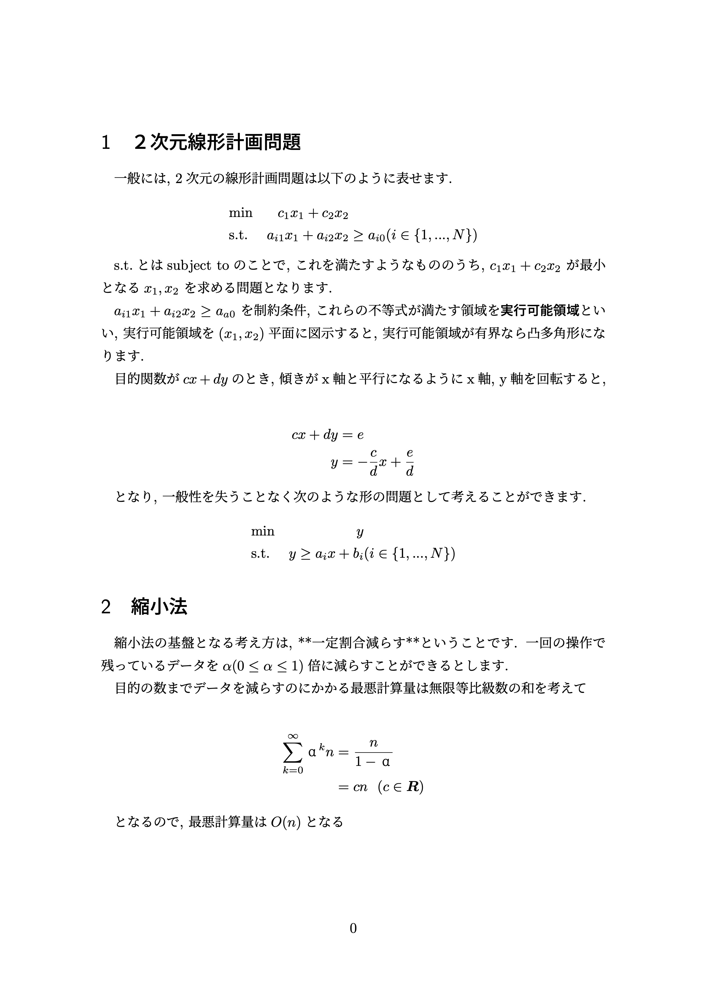
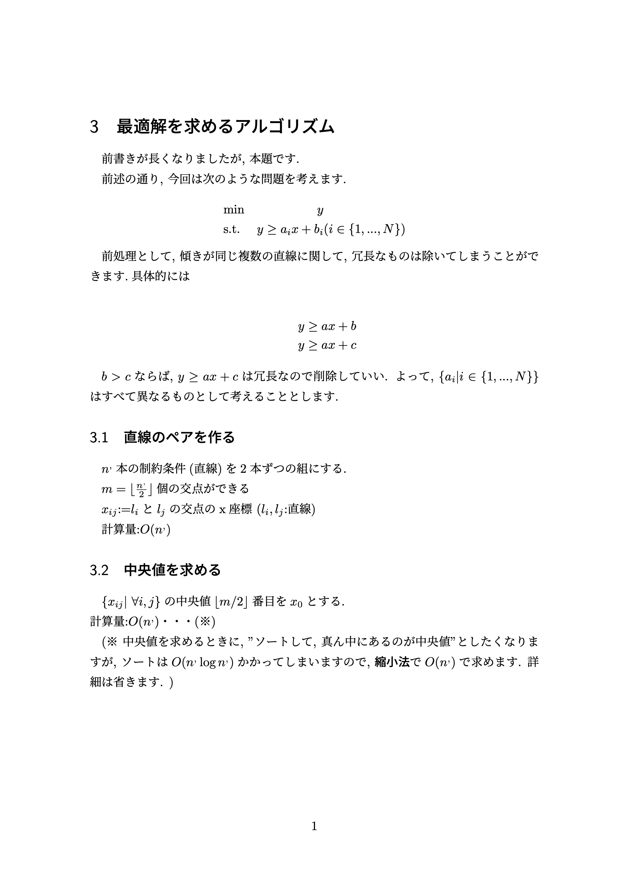
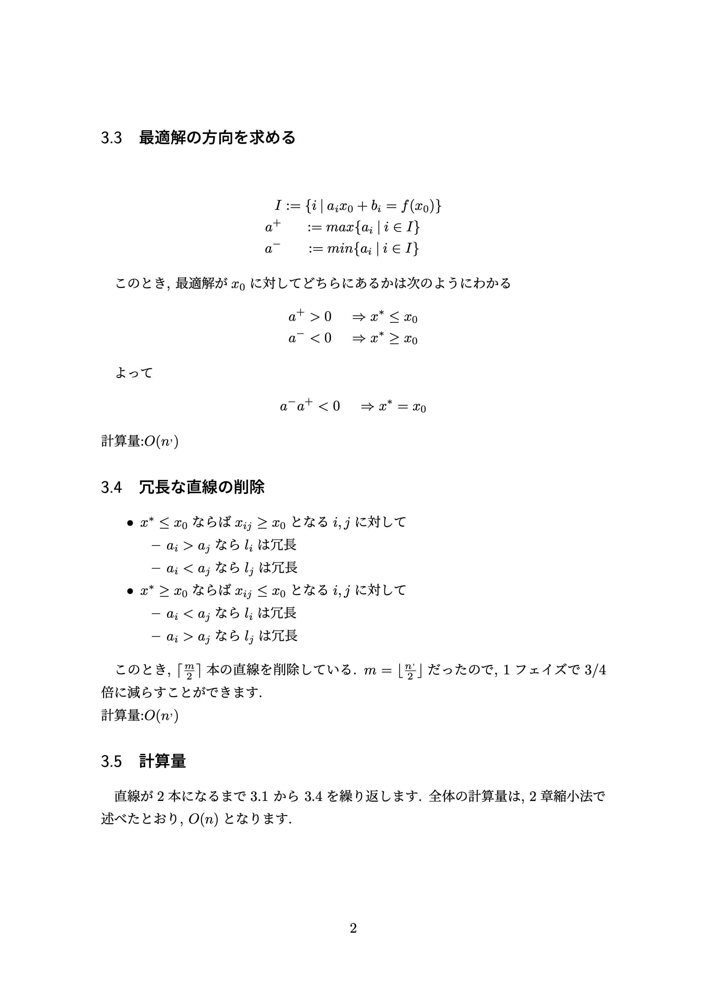

# README

# 参考にしたサイト

* zipで二つのリストを同時にeach文

https://qiita.com/s_tatsuki/items/a01e95812dbef85a3b9d

* ファイルを添付

https://cre8cre8.com/rails/upload-image.htm

* エンターで送信

https://qiita.com/ikm/items/4fc4450ed8eb213039d8

* BootstrapのNAVBAR

https://getbootstrap.jp/docs/4.2/components/navbar/

* BootstrapのSpacing

https://getbootstrap.jp/docs/4.2/utilities/spacing/

* Bootstrapのよく使うクラス 

https://qiita.com/nakanishi03/items/c80a16b9b9796c25f890#shadow